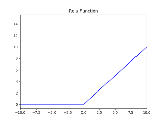
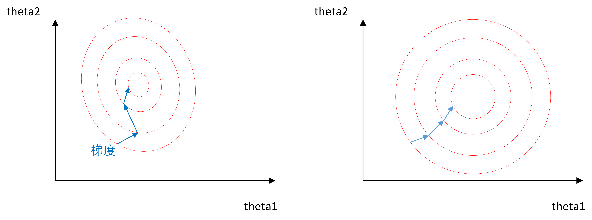

## 激活函数
### 激活函数有哪些性质？
- 1. 非线性： 当激活函数是线性的，一个两层的神经网络就可以基本上逼近所有的函数。但如果激活函数是恒等激活函数的时候，即 f(x)=x，就不满足这个性质，而且如果使用的是恒等激活函数，那么其实整个网络跟单层神经网络是等价的；
- 2. 可微性： 当优化方法是基于梯度的时候，就体现了该性质；
- 3. 单调性： 当激活函数是单调的时候，单层网络能够保证是凸函数；
- 4. f(x)≈x： 当激活函数满足这个性质的时候，如果参数的初始化是随机的较小值，那么神经网络的训练将会很高效；如果不满足这个性质，那么就需要详细地去设置初始值；
- 5. 输出值的范围： 当激活函数输出值是有限的时候，基于梯度的优化方法会更加稳定，因为特征的表示受有限权值的影响更显著；当激活函数的输出是无限的时候，模型的训练会更加高效，不过在这种情况小，一般需要更小的 Learning Rate。

### 激活函数对比
[NGDL91]  

- 1.tanh 函数几乎在所有情况下都优于sigmod函数，但有一个例外，在二分类问题上，y值是0或1，所以y尖（y头上有一个^号）值介于[0, 1]，而不是[-1, 1]，此时需要用sigmoid
- 2.sigmoid 和 tanh 函数的共同特点，当 Z->正负无穷，函数的梯度变得很小，接近于零，导致梯度下降的速度变慢。
- 3.ReLU
	- a.当 z 是负值时，导数等于0，即一旦神经元激活值进入负半区，这个神经元就不会训练，即所谓稀疏性。
	- b.ReLU函数的导数程序实现即一个 if-else语句，而sigmoid函数需要进行浮点四则运算，使用ReLU能加快计算。
	- c.**ReLU函数在z > 0 时导数均为常数，不会产生梯度弥散现象，而sigmoid与tanh函数的导数在正负饱和区的导数都接近于0，产生梯度弥散。**这是使用ReLU与Leaky ReLU的主要原因。
- 4.在实际应用中，Leaky ReLU比ReLU效果好，虽然Leaky ReLU用的不多。

### 为什么需要激活函数？
1. 激活函数对模型学习、理解非常复杂和非线性的函数具有重要作用。
2. 激活函数可以引入非线性因素。如果不使用激活函数，则输出信号仅是一个简单的线性函数。线性函数一个一级多项式，线性方程的复杂度有限，从数据中学习复杂函数映射的能力很小。没有激活函数，神经网络将无法学习和模拟其他复杂类型的数据，例如图像、视频、音频、语音等。
3. 激活函数可以把当前特征空间通过一定的线性映射转换到另一个空间，让数据能够更好的被分类。

### 如何选择激活函数？  
​选择一个适合的激活函数并不容易，需要考虑很多因素，通常的做法是，如果不确定哪一个激活函数效果更好，可以把它们都试试，然后在验证集或者测试集上进行评价。然后看哪一种表现的更好，就去使用它。  
以下是常见的选择情况：  
- 1. 如果输出是 0、1 值（二分类问题），则输出层选择 sigmoid 函数，然后其它的所有单元都选择 Relu 函数。
- 2. 如果在隐藏层上不确定使用哪个激活函数，那么通常会使用 Relu 激活函数。有时，也会使用 tanh 激活函数，但 Relu 的一个优点是：当是负值的时候，导数等于 0。
- 3. sigmoid 激活函数：除了输出层是一个二分类问题基本不会用它。
- 4. tanh 激活函数：tanh 是非常优秀的，几乎适合所有场合。
- 5. ReLu 激活函数：最常用的默认函数，如果不确定用哪个激活函数，就使用 ReLu 或者 Leaky ReLu，再去尝试其他的激活函数。
- 6. 如果遇到了一些死的神经元，我们可以使用 Leaky ReLU 函数。

### ReLu 激活函数的优点？
- 1. 在区间变动很大的情况下，ReLu 激活函数的导数或者激活函数的斜率都会远大于 0，在程序实现就是一个 if-else 语句，而 sigmoid 函数需要进行浮点四则运算，在实践中，使用 ReLu 激活函数神经网络通常会比使用 sigmoid 或者 tanh 激活函数学习的更快。
- 2. sigmoid 和 tanh 函数的导数在正负饱和区的梯度都会接近于 0，这会造成梯度弥散，而 Relu 和Leaky ReLu 函数大于 0 部分都为常数，不会产生梯度弥散现象。
- 3. 需注意，Relu 进入负半区的时候，梯度为 0，神经元此时不会训练，产生所谓的稀疏性，而 Leaky ReLu 不会产生这个问题。

### 怎样理解 Relu（< 0 时）是非线性激活函数？
Relu 激活函数图像如下：  
  
根据图像可看出具有如下特点：  
- 1. 单侧抑制；
- 2. 相对宽阔的兴奋边界；
- 3. 稀疏激活性；
	- ReLU 函数从图像上看，是一个分段线性函数，把所有的负值都变为 0，而正值不变，这样就成为单侧抑制。
	- 因为有了这单侧抑制，才使得神经网络中的神经元也具有了稀疏激活性。

   **稀疏激活性**：从信号方面来看，即神经元同时只对输入信号的少部分选择性响应，大量信号被刻意的屏蔽了，这样可以提高学习的精度，更好更快地提取稀疏特征。当 x<0 时，ReLU 硬饱和，而当 x>0 时，则不存在饱和问题。ReLU 能够在 x>0 时保持梯度不衰减，从而缓解梯度消失问题。

### 为什么要用非线性激活函数？ 
    
    
假若网络中全部是线性部件，那么线性的组合还是线性，与单独一个线性分类器无异。这样就做不到用非线性来逼近任意函数。  
使用非线性激活函数 ，以便使网络更加强大，增加它的能力，使它可以学习复杂的事物，复杂的表单数据，以及表示输入输出之间非线性的复杂的任意函数映射。使用非线性激活函数，能够从输入输出之间生成非线性映射。  
**不能在隐藏层使用线性激活函数，唯一可用线性激活函数的是输出层**  
ReLU看起来是线性，其实是非线性，相当于一个分段函数。

## Softmax
## Softmax 函数如何应用于多分类？  
​ softmax 用于多分类过程中，它将多个神经元的输出，映射到 (0,1)  区间内，可以看成概率来理解，从而来进行多分类。  
假设输入是 3,1,-3  通过 softmax 函数作用，就映射成为 (0,1) 的值，而这些值的累和为 1（满足概率的性质），那么我们就可以将它理解成概率，在最后选取输出结点的时候，就可以选取概率最大（也就是值对应最大的）结点，作为我们的预测目标。  

## 卷积
[NGDL356, 372]
### same方式卷积中padding的好处：
- 若不使用 padding，每次作卷积图像都会缩小
- 图像边缘的像素点在输出中采用较少，意味着丢掉了图像边缘像素的许多信息，使用padding使图像边缘的像素与中间
的像素采样数一样多。
### 卷积输入输出满足的计算公式
same方式下：
输出 size = (n + 2p - f)/s + 1，结果向下取整    
n: 输入尺寸，p: padding，f: 过滤器filter size，s: stride  
其实池化也满足这个公式，池化时，相当于 p=0, s=2  
valid模式下：
上式的 p=0

### 设某层有过滤器n=N，filter size = W * H * C，那么共有参数多少？
(W * H * C + 1) * N  
即卷积这种方式相比于全连接来说，参数大大减少。模型的参数不会随着输入图片的 size 变化而变化。 

### 对pooling的理解？
最大值池化：Max pooling.  
若 feature map 中的某一位值特别大，则这一位置很可能就是有用的特征（参考边缘检测过滤器输出的 feature map），保留最大值即保留特征。
- 最大池化能更好地保留纹理信息
- 平均池化（mean pooling）保留数据地整体特征，突出背景信息      
用池化提取特征有两个误差：  
- 1.领域大小受限，造成了估计值方差增大
- 2.卷积层参数误差造成了估计均值地偏移，平均池化减少了第一种误差，最大池化减少了第二种误差
池化层没有需要学习地参数，池化后 channel 与输入相同，仅改变 size  
[NGDL381]  

### 1 * 1 卷积核的理解
  
  
  

### 为什么使用深层表示?
1. 深度神经网络是一种特征递进式的学习算法，浅层的神经元直接从输入数据中学习一些低层次的简单特征，例如边缘、纹理等。而深层的特征则基于已学习到的浅层特征继续学习更高级的特征，从计算机的角度学习深层的语义信息。
2. 深层的网络隐藏单元数量相对较少，隐藏层数目较多，如果浅层的网络想要达到同样的计算结果则需要指数级增长的单元数量才能达到。

### 为什么深层神经网络难以训练？
- 1. 梯度消失  
梯度消失是指通过隐藏层从后向前看，梯度会变的越来越小，说明前面层的学习会显著慢于后面层的学习，所以学习会卡住，除非梯度变大。梯度消失的原因受到多种因素影响，例如学习率的大小，网络参数的初始化，激活函数的边缘效应等。在深层神经网络中，每一个神经元计算得到的梯度都会传递给前一层，较浅层的神经元接收到的梯度受到之前所有层梯度的影响。如果计算得到的梯度值非常小，随着层数增多，求出的梯度更新信息将会以指数形式衰减，就会发生梯度消失。下图是不同隐含层的学习速率：

- 2. 梯度爆炸
    	在深度网络或循环神经网络（Recurrent Neural Network, RNN）等网络结构中，梯度可在网络更新的过程中不断累积，变成非常大的梯度，导致网络权重值的大幅更新，使得网络不稳定；在极端情况下，权重值甚至会溢出，变为 NaN 值，再也无法更新。
- 3. 权重矩阵的退化导致模型的有效自由度减少（了解就好）。

### 神经网络更“深”有什么意义？
前提：在一定范围内。
- 在神经元数量相同的情况下，深层网络结构具有更大容量，分层组合带来的是指数级的表达空间，能够组合成更多不同类型的子结构，这样可以更容易地学习和表示各种特征。
- 隐藏层增加则意味着由激活函数带来的非线性变换的嵌套层数更多，就能构造更复杂的映射关系。

## Batch_size
### 为什么需要 Batch_Size？  
Batch的选择，首先决定的是下降的方向。  
如果数据集比较小，可采用全数据集的形式，好处是：  
- 1. 由全数据集确定的方向能够更好地代表样本总体，从而更准确地朝向极值所在的方向。
- 2. 由于不同权重的梯度值差别巨大，因此选取一个全局的学习率很困难。 Full Batch Learning 可以使用 Rprop 只基于梯度符号并且针对性单独更新各权值。  
对于更大的数据集，假如采用全数据集的形式，坏处是：  
- 1. 随着数据集的海量增长和内存限制，一次性载入所有的数据进来变得越来越不可行。
- 2. 以 Rprop 的方式迭代，会由于各个 Batch 之间的采样差异性，各次梯度修正值相互抵消，无法修正。这才有了后来 RMSProp 的妥协方案。 

### Batch_Size 值的选择  
假如每次只训练一个样本，即 Batch_Size = 1。线性神经元在均方误差代价函数的错误面是一个抛物面，横截面是椭圆。对于多层神经元、非线性网络，在局部依然近似是抛物面。此时，每次修正方向以各自样本的梯度方向修正，横冲直撞各自为政，难以达到收敛。  
既然 Batch_Size 为全数据集或者Batch_Size = 1都有各自缺点，可不可以选择一个适中的Batch_Size值呢？  
此时，可采用批梯度下降法（Mini-batches Learning）。因为如果数据集足够充分，那么用一半（甚至少得多）的数据训练算出来的梯度与用全部数据训练出来的梯度是几乎一样的。  

### 在合理范围内，增大Batch_Size有何好处？
- 1. 内存利用率提高了，大矩阵乘法的并行化效率提高。
- 2. 跑完一次 epoch（全数据集）所需的迭代次数减少，对于相同数据量的处理速度进一步加快。
- 3. 在一定范围内，一般来说 Batch_Size 越大，其确定的下降方向越准，引起训练震荡越小。

### 盲目增大 Batch_Size 有何坏处？
- 1. 内存利用率提高了，但是内存容量可能撑不住了。
- 2. 跑完一次 epoch（全数据集）所需的迭代次数减少，要想达到相同的精度，其所花费的时间大大增加了，从而对参数的修正也就显得更加缓慢。
- 3. Batch_Size 增大到一定程度，其确定的下降方向已经基本不再变化。

### 调节 Batch_Size 对训练效果影响到底如何？
- 1. Batch_Size 太小，模型表现效果极其糟糕(error飙升)。
- 2. 随着 Batch_Size 增大，处理相同数据量的速度越快。
- 3. 随着 Batch_Size 增大，达到相同精度所需要的 epoch 数量越来越多。
- 4. 由于上述两种因素的矛盾， Batch_Size 增大到某个时候，达到时间上的最优。
- 5. 由于最终收敛精度会陷入不同的局部极值，因此 Batch_Size 增大到某些时候，达到最终收敛精度上的最优。

## 归一化
### 归一化含义？
- 1. 归纳统一样本的统计分布性。归一化在  [0, 1] 是统计的概率分布，归一化在 [-1, 1] 是统计的坐标分布。
- 2. 无论是为了建模还是为了计算，首先基本度量单位要同一，神经网络是以样本在事件中的统计分别几率来进行训练（概率计算）和预测，且 sigmoid 函数的取值是 0 到 1 之间的，网络最后一个节点的输出也是如此，所以经常要对样本的输出归一化处理。  
- 3. 归一化是统一在 [0, 1] 之间的统计概率分布，当所有样本的输入信号都为正值时，与第一隐含层神经元相连的权值只能同时增加或减小，从而导致学习速度很慢。  
- 4. 在数据中常存在奇异样本数据，奇异样本数据存在所引起的网络训练时间增加，并可能引起网络无法收敛。为了避免出现这种情况及后面数据处理的方便，加快网络学习速度，可以对输入信号进行归一化，使得所有样本的输入信号其均值接近于 0 或与其均方差相比很小。

### 为什么要归一化？
- 1. 为了后面数据处理的方便，归一化的确可以避免一些不必要的数值问题。
- 2. 为了程序运行时收敛加快。 
- 3. 同一量纲。样本数据的评价标准不一样，需要对其量纲化，统一评价标准。这算是应用层面的需求。
- 4. 避免神经元饱和。就是当神经元的激活在接近 0 或者 1 时会饱和，在这些区域，梯度几乎为 0，这样，在反向传播过程中，局部梯度就会接近 0，这会有效地“杀死”梯度。
- 5. 保证输出数据中数值小的不被吞食。 

### 为什么归一化能提高求解最优解速度？
  
上图是代表数据是否均一化的最优解寻解过程（圆圈可以理解为等高线）。左图表示未经归一化操作的寻解过程，右图表示经过归一化后的寻解过程。  
当使用梯度下降法寻求最优解时，很有可能走“之字型”路线（垂直等高线走），从而导致需要迭代很多次才能收敛；而右图对两个原始特征进行了归一化，其对应的等高线显得很圆，在梯度下降进行求解时能较快的收敛。  
因此如果机器学习模型使用梯度下降法求最优解时，归一化往往非常有必要，否则很难收敛甚至不能收敛。  

### 什么是批归一化（Batch Normalization，BN）
以前在神经网络训练中，只是对输入层数据进行归一化处理，却没有在中间层进行归一化处理。要知道，虽然我们对输入数据进行了归一化处理，但是输入数据经过 sigmoid(WX+b) 这样的矩阵乘法以及非线性运算之后，其数据分布很可能被改变，而随着深度网络的多层运算之后，数据分布的变化将越来越大。如果我们能在网络的中间也进行归一化处理，就能对网络的训练起到改进作用。

### 批归一化（BN）的优点
BN 归一化是将 z 值归一化  
- 1. 减少了人为选择参数。在某些情况下可以取消 dropout 和 L2 正则项参数,或者采取更小的 L2 正则项约束参数； 
- 2. 减少了对学习率的要求。现在我们可以使用初始很大的学习率或者选择了较小的学习率，算法也能够快速训练收敛； 
- 3.BN减少了输入值改变的问题，使这些值变得更加稳定，即使输入分布发生改变，经过BN也会变化很少。它使当前层保持学习，当输入值改变时，迫使后层适应的程度减小，即弱化了前层参数作用与后层参数作用之间的联系，使网络每层可以自己学习，稍微独立于其他层，有助于整个网络的学习。[NGDL223, 228]
- 4.BN有轻微的正则化效果：因为标准偏差的缩放和减去均值带来额外噪音。
- 5. 破坏原来的数据分布，一定程度上缓解过拟合（防止每批训练中某一个样本经常被挑选到，文献说这个可以提高 1% 的精度）。 
- 6. 减少梯度消失，加快收敛速度，提高训练精度。

### BN 和 GN 比较

| 名称                                           | 特点                                                         |
| ---------------------------------------------- | :----------------------------------------------------------- |
| 批量归一化（Batch Normalization，以下简称 BN） | 可让各种网络并行训练。但是，批量维度进行归一化会带来一些问题——批量统计估算不准确导致批量变小时，BN 的误差会迅速增加。在训练大型网络和将特征转移到计算机视觉任务中（包括检测、分割和视频），内存消耗限制了只能使用小批量的 BN。 |
| 群组归一化 Group Normalization (简称 GN)       | GN 将通道分成组，并在每组内计算归一化的均值和方差。GN 的计算与批量大小无关，并且其准确度在各种批量大小下都很稳定。 |
| 比较                                           | 在 ImageNet 上训练的 ResNet-50上，GN 使用批量大小为 2 时的错误率比 BN 的错误率低 10.6％ ;当使用典型的批量时，GN 与 BN 相当，并且优于其他标归一化变体。而且，GN 可以自然地从预训练迁移到微调。在进行 COCO 中的目标检测和分割以及 Kinetics 中的视频分类比赛中，GN 可以胜过其竞争对手，表明 GN 可以在各种任务中有效地取代强大的 BN。 |

## 预训练与微调(fine tuning)
### 为什么无监督预训练可以帮助深度学习？
深度网络存在问题:  
- 1. 网络越深，需要的训练样本数越多。若用监督则需大量标注样本，不然小规模样本容易造成过拟合。深层网络特征比较多，会出现的多特征问题主要有多样本问题、规则化问题、特征选择问题。
- 2. 多层神经网络参数优化是个高阶非凸优化问题，经常得到收敛较差的局部解；
- 3. 梯度扩散问题，BP算法计算出的梯度随着深度向前而显著下降，导致前面网络参数贡献很小，更新速度慢。  
**解决方法：**  
- 逐层贪婪训练，无监督预训练（unsupervised pre-training）即训练网络的第一个隐藏层，再训练第二个…最后用这些训练好的网络参数值作为整体网络参数的初始值。  
- 经过预训练最终能得到比较好的局部最优解。

### 什么是模型微调fine tuning
用别人的参数、修改后的网络和自己的数据进行训练，使得参数适应自己的数据，这样一个过程，通常称之为微调（fine tuning).   
**模型的微调举例说明：**
我们知道，CNN 在图像识别这一领域取得了巨大的进步。如果想将 CNN 应用到我们自己的数据集上，这时通常就会面临一个问题：通常我们的 dataset 都不会特别大，一般不会超过 1 万张，甚至更少，每一类图片只有几十或者十几张。这时候，直接应用这些数据训练一个网络的想法就不可行了，因为深度学习成功的一个关键性因素就是大量带标签数据组成的训练集。如果只利用手头上这点数据，即使我们利用非常好的网络结构，也达不到很高的 performance。这时候，fine-tuning 的思想就可以很好解决我们的问题：我们通过对 ImageNet 上训练出来的模型（如CaffeNet,VGGNet,ResNet) 进行微调，然后应用到我们自己的数据集上。

### 微调时候网络参数是否更新？
会更新。  
- 1. finetune 的过程相当于继续训练，跟直接训练的区别是初始化的时候。 
- 2. 直接训练是按照网络定义指定的方式初始化。
- 3. finetune是用你已经有的参数文件来初始化。

### fine-tuning 模型的三种状态
- 1. 状态一：只预测，不训练。  
特点：相对快、简单，针对那些已经训练好，现在要实际对未知数据进行标注的项目，非常高效；  
- 2. 状态二：训练，但只训练最后分类层。  
特点：fine-tuning的模型最终的分类以及符合要求，现在只是在他们的基础上进行类别降维。  
- 3. 状态三：完全训练，分类层+之前卷积层都训练  
特点：跟状态二的差异很小，当然状态三比较耗时和需要训练GPU资源，不过非常适合fine-tuning到自己想要的模型里面，预测精度相比状态二也提高不少。

## 学习率
### 学习率的作用
在机器学习中，监督式学习通过定义一个模型，并根据训练集上的数据估计最优参数。梯度下降法是一个广泛被用来最小化模型误差的参数优化算法。梯度下降法通过多次迭代，并在每一步中最小化成本函数（cost 来估计模型的参数。**学习率 (learning rate)，在迭代过程中会控制模型的学习进度。**
在梯度下降法中，都是给定的统一的学习率，整个优化过程中都以确定的步长进行更新， 在迭代优化的前期中，学习率较大，则前进的步长就会较长，这时便能以较快的速度进行梯度下降，而在迭代优化的后期，逐步减小学习率的值，减小步长，这样将有助于算法的收敛，更容易接近最优解。故而如何对学习率的更新成为了研究者的关注点。  
在模型优化中，常用到的几种学习率衰减方法有：分段常数衰减、多项式衰减、指数衰减、自然指数衰减、余弦衰减、线性余弦衰减、噪声线性余弦衰减。  

## 3.12 Dropout 系列问题

### 3.12.1 为什么要正则化？   
1. 深度学习可能存在过拟合问题——高方差，有两个解决方法，一个是正则化，另一个是准备更多的数据，这是非常可靠的方法，但你可能无法时时刻刻准备足够多的训练数据或者获取更多数据的成本很高，但正则化通常有助于避免过拟合或减少你的网络误差。  
2. 如果你怀疑神经网络过度拟合了数据，即存在高方差问题，那么最先想到的方法可能是正则化，另一个解决高方差的方法就是准备更多数据，这也是非常可靠的办法，但你可能无法时时准备足够多的训练数据，或者，获取更多数据的成本很高，但正则化有助于避免过度拟合，或者减少网络误差。

### 3.12.2 为什么正则化有利于预防过拟合？ 

 
 

左图是高偏差，右图是高方差，中间是Just Right，这几张图我们在前面课程中看到过。  

### 理解dropout正则化  
直观上理解：Dropout可以随机删除网络中的神经单元，使网络不过于依赖某个特征，不会给某一个输入加太多权重，使权重的平方减少，产生收缩权重平方范数的效果，类似于L2正则化。实施dropout会压缩权重，并完成一个预防过拟合的外层正则化。L2对不同权重的衰减是不同的，它取决于激活函数倍增的大小。  

### dropout率的选择
- 1. 经过交叉验证，隐含节点 dropout 率等于 0.5 的时候效果最好，原因是 0.5 的时候 dropout 随机生成的网络结构最多。
- 2. dropout 也可以被用作一种添加噪声的方法，直接对 input 进行操作。输入层设为更接近 1 的数。使得输入变化不会太大（0.8） 

### dropout有什么缺点？  
dropout一大缺点就是代价函数 J 不再被明确定义，每次迭代，都会随机移除一些节点，如果再三检查梯度下降的性能，实际上是很难进行复查的。定义明确的代价函数 J 每次迭代后都会下降，因为我们所优化的代价函数 J 实际上并没有明确定义，或者说在某种程度上很难计算，所以我们失去了调试工具来绘制这样的图片。我通常会关闭dropout函数，将keep-prob的值设为1，运行代码，确保 J 函数单调递减。然后打开dropout函数，希望在dropout过程中，代码并未引入bug。我觉得你也可以尝试其它方法，虽然我们并没有关于这些方法性能的数据统计，但你可以把它们与dropout方法一起使用。  

## 深度学习中常用的数据增强方法？
- Color Jittering：对颜色的数据增强：图像亮度、饱和度、对比度变化（此处对色彩抖动的理解不知是否得当）；
- Random Scale：尺度变换；
- Random Crop：采用随机图像差值方式，对图像进行裁剪、缩放；包括Scale Jittering方法（VGG及ResNet模型使用）或者尺度和长宽比增强变换；
- Horizontal/Vertical Flip：水平/垂直翻转；
- Shift：平移变换；
- Rotation/Reflection：旋转/仿射变换；
- Noise：高斯噪声、模糊处理；
- Label Shuffle：类别不平衡数据的增广；
- PCA  Jittering：首先按照RGB三个颜色通道计算均值和标准差，再在整个训练集上计算协方差矩阵，进行特征分解，得到特征向量和特征值，用来做PCA Jittering；

## 如何理解 Internal Covariate Shift？
深度神经网络模型的训练为什么会很困难？其中一个重要的原因是，深度神经网络涉及到很多层的叠加，而每一层的参数更新会导致上层的输入数据分布发生变化，通过层层叠加，高层的输入分布变化会非常剧烈，这就使得高层需要不断去重新适应底层的参数更新。为了训好模型，我们需要非常谨慎地去设定学习率、初始化权重、以及尽可能细致的参数更新策略。  
Google 将这一现象总结为 Internal Covariate Shift，简称 ICS。 什么是 ICS 呢？  
大家都知道在统计机器学习中的一个经典假设是“源空间（source domain）和目标空间（target domain）的数据分布（distribution）是一致的”。如果不一致，那么就出现了新的机器学习问题，如 transfer learning / domain adaptation 等。而 covariate shift 就是分布不一致假设之下的一个分支问题，它是指源空间和目标空间的条件概率是一致的，但是其边缘概率不同。  
大家细想便会发现，的确，对于神经网络的各层输出，由于它们经过了层内操作作用，其分布显然与各层对应的输入信号分布不同，而且差异会随着网络深度增大而增大，可是它们所能“指示”的样本标记（label）仍然是不变的，这便符合了covariate shift的定义。由于是对层间信号的分析，也即是“internal”的来由。  

**那么ICS会导致什么问题？**
简而言之，每个神经元的输入数据不再是“独立同分布”。  
- 其一，上层参数需要不断适应新的输入数据分布，降低学习速度。  
- 其二，下层输入的变化可能趋向于变大或者变小，导致上层落入饱和区，使得学习过早停止。  
- 其三，每层的更新都会影响到其它层，因此每层的参数更新策略需要尽可能的谨慎。  

#### 推荐/参考链接
- [吴恩达深度学习笔记](http://www.ai-start.com/dl2017/)
- [深度学习基础](https://github.com/scutan90/DeepLearning-500-questions/blob/master/ch03_%E6%B7%B1%E5%BA%A6%E5%AD%A6%E4%B9%A0%E5%9F%BA%E7%A1%80/%E7%AC%AC%E4%B8%89%E7%AB%A0_%E6%B7%B1%E5%BA%A6%E5%AD%A6%E4%B9%A0%E5%9F%BA%E7%A1%80.md)

